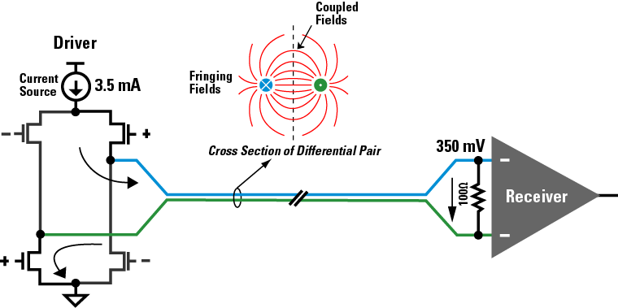
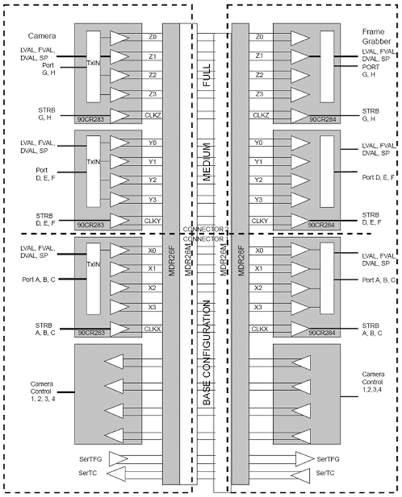
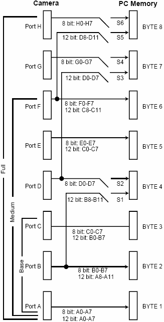
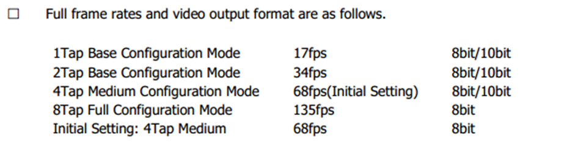
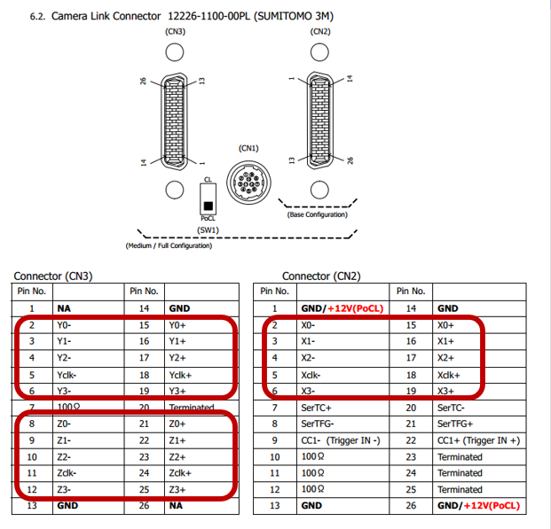
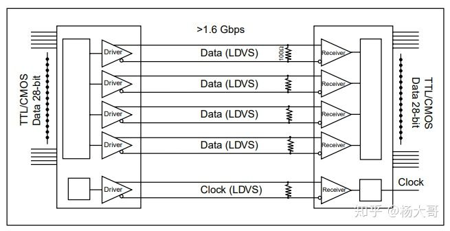
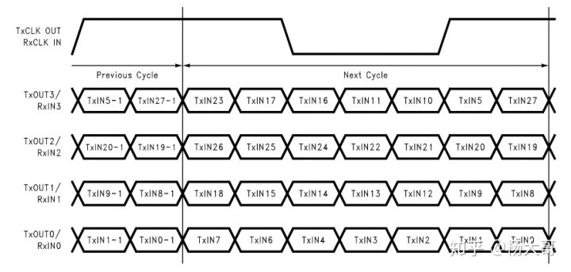
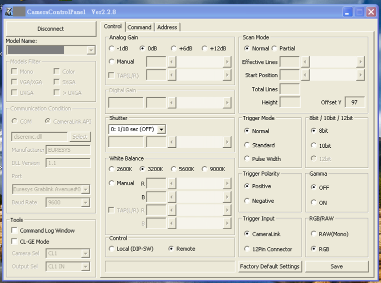

這是我對Camera Link的學習心得，其實了解Camera Link的硬體架構後會發現其實它很單純，而且改良以前Anlog影像擷取卡相機遇到的一些問題，使用起來更為便利，了解Camera Link後對於之後的 CoaXPress 應該也會更快上手。

# Camera Link 由來
當初國家半導體公司(National Semicndmtor)開發設計出Channel Link的相關技術，主要實體層架構是以LVDS規範為基礎，作為平面顯示等關聯性產品的解決途徑。後來，這種技術也被延伸應用於進行資料傳輸的一般用途。  

Camera Link規格是由AIA協會（Automate Imaging Association）定義，該協會則是由工業用攝像機、信號線、影像擷取卡製造商所組成的產業組織。  

* 長度限制：  
  數據傳輸距離受到限制、最長只能達到10m，可透過光纖訊號轉換器將訊號轉換成光纖，使得傳輸距離更遠。

* 影像擷取卡供電：  
  Mini Camera Link的誕生，相機縮小的同時逐漸出現擷取卡供電`PoCL`的趨勢，只要使使用原本的線材即可達成

* 信號規格：  
  Camera Link採用`低電壓差分信號`（LVDS）  

  低電壓差分傳輸是一種信號傳輸的技術，區別於傳統的一根信號線一根地線的做法，差分傳輸在這兩根線上都傳輸信號，這兩個信號的振幅相等，相位相反。在這兩根線上的傳輸的信號就是差分信號。信號接收端比較這兩個電壓的差值來判斷發送端發送的是邏輯0 還是邏輯1 。在電路板上，差分走線必須是等長、等寬、緊密靠近、且在同一層面的兩根線。  

* 支援多台相機：  
  影像擷取卡中也有可以連接多台相機的產品

---
# Camera Link標準提供三種組態
* Base組態 (一組連接器)  
  包含一組傳送器/接收器，24 bits的視訊資料分為A、B、C三個8-bit連接埠，在使用20~85 MHz時脈之下，影像資料傳輸率可高達2.04 Gbps。

* Medium組態 (兩組連接器)  
  增加第二組傳送器/接收器對，影像資料位元倍增為48 bits（8-bit連接埠亦倍增為六個：A、B、C、D、E、F）、資料傳輸率倍增為4.08 Gbps。

* Full組態 (兩組連接器)  
  再次增加影像資料位元為64 bits，使用八個8-bit連接埠：A、B、C、D、E、F、G、H，提高影像資料傳輸率為5.44 Gbps。

* Extended-Full (兩組連接器)  
  使用Full組態的硬體配置，將Base、Medium、Full影像同步訊號(LVAL、FVAL、DVAL、SPARE)做了調整與壓縮，三組的同步訊號其實只用的到一組，使用空閒的兩組同步訊號再加上一組空閒的8 bits硬體，這樣就可以再擠出16 bits出來傳遞影像，使得影像資料位元達到80 bits，使用十個8-bit連接埠：A、B、C、D、E、F、G、H、I、J，提高影像資料傳輸率為6.8 Gbps。

## 相機可透過不同的組態達到 不同的頻寬

---
# 信號傳遞
Camera Link最多使用兩組連接線，第一條連接線包含一組資料傳遞硬體 `X0~3 + XClock`，第二條線包含兩組資料傳遞硬體 `Y0~3 + YClock`、`Z0~3 + ZClock`。

剛剛說到 Camera Link使用 LVDS作為訊號傳遞，Camera Link的核心組成元件，包括壹組傳送與接收器。驅動電路接收28個單向資料及一個單向時序後，再將這些訊號以7：1方式作串列化處理轉成4筆資料串列為一個獨立的時序訊號，經由5對LVDS差壓信號線，輸出並傳出至另一接收端。當接受器收到前述之訊號之後，再反向轉成28個單向資料及一個單向時序，並直接進入影像卡之輸入端。  

一組資料傳遞硬體一個Clock周週期可以傳遞 28bit 資料。

## 始能訊號 (同步訊號)
* FVAL  
  為1時表示行有效，FVAL和有效數據之間不應該有偏移
* LVAL  
  為1時表示有效像素，LVAL和有效像素之間不應該有偏移
* DVAL  
  為1時表示資料有效
* Spare  
  預留

## 相機控制訊號
Camera Link協議中保留四對 LVDS 信號，用於相機輸入，影像擷取卡輸出。協議沒有規定這四組信號的使用方式。一般來說 相機的Trigger信號默認會使用 CC1
* Camera Control 1（CC1）
* Camera Control 2（CC2）
* Camera Control 3（CC3）
* Camera Control 4（CC4）

## 相機通訊
協議中定義兩對 LVDS信號用於相機與影像擷取卡之間的串列傳輸，用於相機設定值得設定
* SerTFG
* SerTC

如下圖 為某相機設定軟體，會透過 Camera Link 影像擷取卡 開啟的串列傳輸通道設定相機。  

---
# 參考資料
* [談PC-based架構的線掃描(Line-scan)影像檢測系統 - 凌華科技自動化產品事業部 黃卿銘](http://www.adlinktech.com/big5/solution/tech_forum.php?file=measure/20050816.htm)
* [cameralink笔记](https://zhuanlan.zhihu.com/p/246170715)
* [我的cameralink協議學習筆記](https://www.gushiciku.cn/pl/phFF/zh-tw)
* [Camera Link Specifications](https://www.imagelabs.com/wp-content/uploads/2010/10/CameraLink5.pdf)

