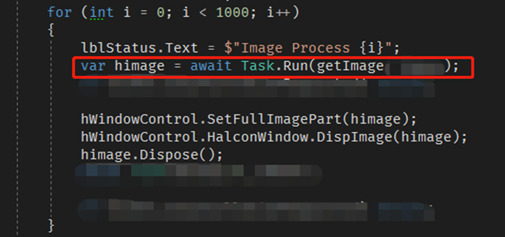
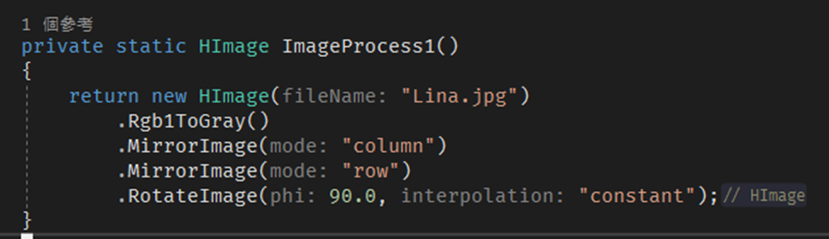
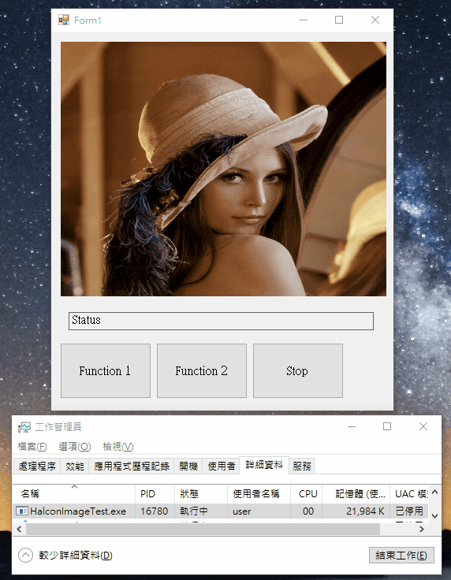
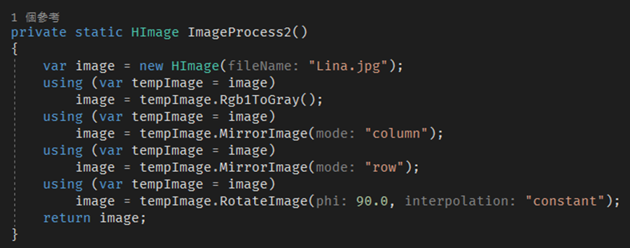

# 問題情境
假設因相機或機構問題，相機取到的影像需做簡易影像旋轉和翻轉功能。我們來做幾個簡單的實驗，驗證影像記憶體的佔用情況。

需求：
1. 彩色黑白轉換
2. 水平翻轉
3. 垂直翻轉
4. 旋轉

# 跑一千次觀察記憶體使用量

## 方案一
`HImage`依序做完所有的影像處理。

## 方案二
`HImage` 每做完一個影像處裡，就`Dispose`前一張影像`

# 結論
Halcon 每做完一次影像處理，其實是做資料複製，記憶體中的資料從一張影像會變成兩張影像，做越多次處裡記憶體的佔用也就越大，所以記得每次處理完都需要做影像銷毀。

附上[範例程式碼](https://github.com/patrick85081/HalconImageMemory)，執行前請先安裝`Halcon 12`  
