這裡來介紹一下三菱MT-2200 馬達脈波控制器使用方式。

市面上的馬達驅動器分為兩種，一種是**脈波(Plus)**與**資料通訊**的訊號傳
遞方式，脈波型是屬於通用型，不同廠牌的控制器、馬達驅動器與馬達只要送相對應的脈波都可以互相控制，但是資料通訊就不一樣了，各家都有各家的通訊方式無法互通，換句話說全部都只能使用同一家的設備，資料通訊的好處是時脈可以比脈波通訊快很多，而且佈線走線都很簡單而且訊號品質也會比脈波好，三菱走的是`SSCNET III/H`光纖通訊。

當需要同時控制脈波型與通訊型的馬達時，正常的情況只能分別接兩種運動控制卡分別控制，`MT-2000`系列目的就是讓脈波型的馬達驅動器經過通訊卡(MT-2010)，也可以走`SSCNET III/H`通訊，優點是可以**減少一張脈波型運動控制卡成本**。

* MT-2010 為通訊卡  
  可以將MT-2000系列的裝置使用`SSCNET III/H`通訊

* MT-2100 為數位IO卡  

* MT-2200 為脈波控制卡  
  可以透過此卡操控脈波型的馬達

* MT-2300 為類比IO卡  

* MT-2400 為Encoder 輸入卡  

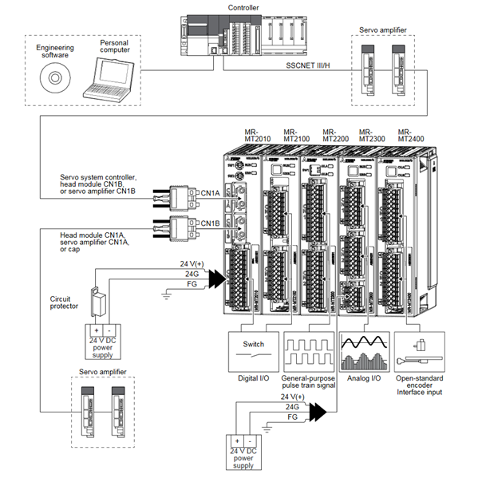

# 安裝
使用工業卡扣的設計  
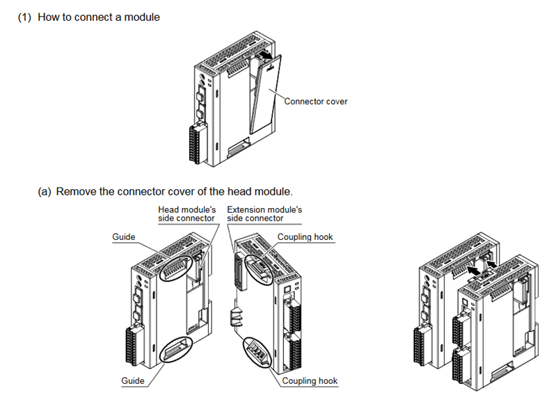

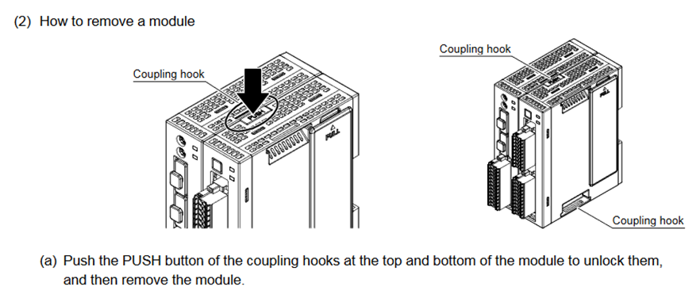

# 區塊
一張`MT-2010`通訊卡最多只能接四個模組(設備)，通訊卡加上底下的設備稱為一個區塊(Block)。  
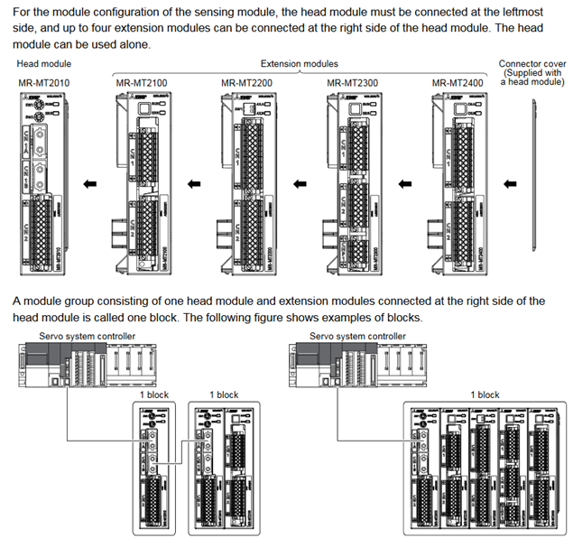

# MT-2200 脈波控制卡
脈波控制卡的最大特色是，他擁有兩組脈波IO訊號，可以分別選擇脈波要當 輸入還是輸出功能。

## 設定 軸號/站號
在MT-2200上頭有兩個旋轉開關，由此設定 `SSCNET III/H`的設備編號  
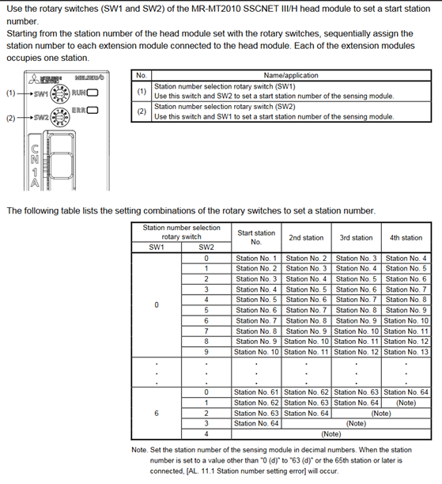

## 模式設定
MT-2200有兩種模式，一種稱為站模式(Station Mode)和軸模式(Axis Mode)
* 站模式  
  此模式就像把MT-2200當成脈波控制的IO卡，自行控制脈波的輸出。

* 軸模式 (推薦)  
  此模式就像把MT-2200當成運動控制卡來做控制，軟體面來說就跟操控一般馬達沒有兩樣。  
  前面有說到 脈波控制卡有兩組脈波IO，可以分別選擇要做 輸入還是輸出使用，對應馬達控制的話就是要 **輸出馬達訊號** 還是 **Encoder回授訊號接收**，換句話說要讓 MT-2200 輸出脈波給兩個馬達，還是 輸出脈波給一個馬達並接收一個Encoder訊號。  

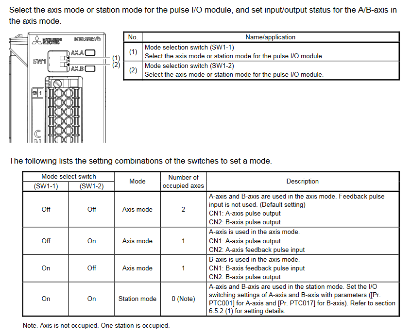

## 接線方式
把 `MT-2010`通訊卡當作一般的三菱驅動器接線即可。  
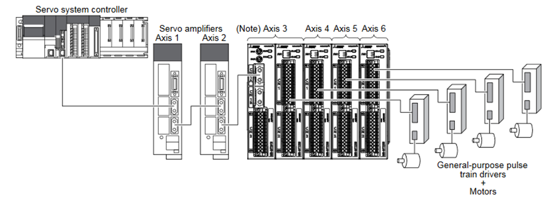

> 這裡特別要記住，前面說過一個MT-2010可以接四個設備，如果一個MT-2200輸出訊號給兩個馬達，這樣一個MT-2200就算兩個設備。  

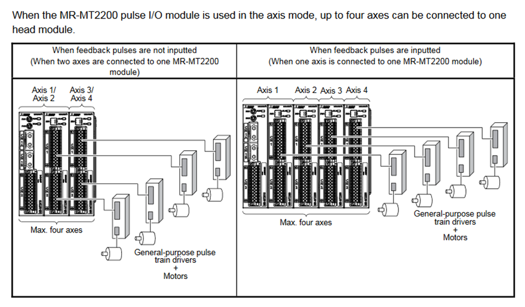

## 站模式 (Station Mode)  
站模式下可以分別控制每一個IO訊號。  
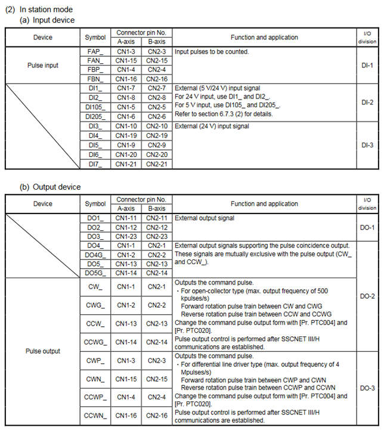

## 驅動器設定
### 驅動器型號
> 0x3015 – 通訊模組Block上的第一軸  
> 0x3025 – 通訊模組Block上的其他軸  

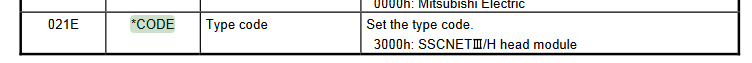

### 輸出脈波設定
單脈波控制、雙脈波控制、AB相控制
信號正反邏輯設定  
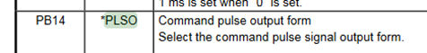
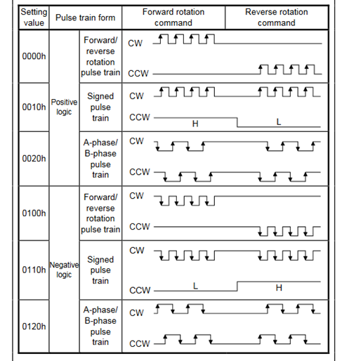

### Encoder 輸入設定
單脈波控制、雙脈波控制、AB相控制
信號正反邏輯設定
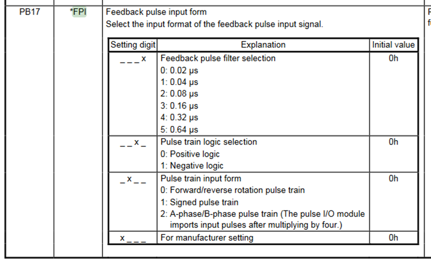