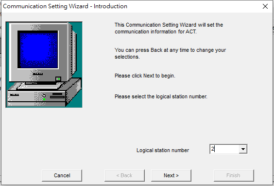
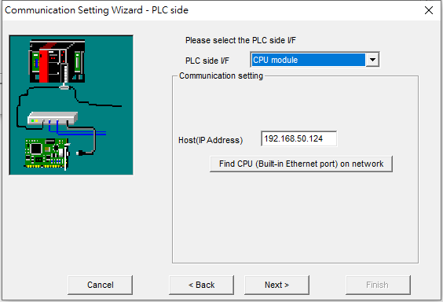
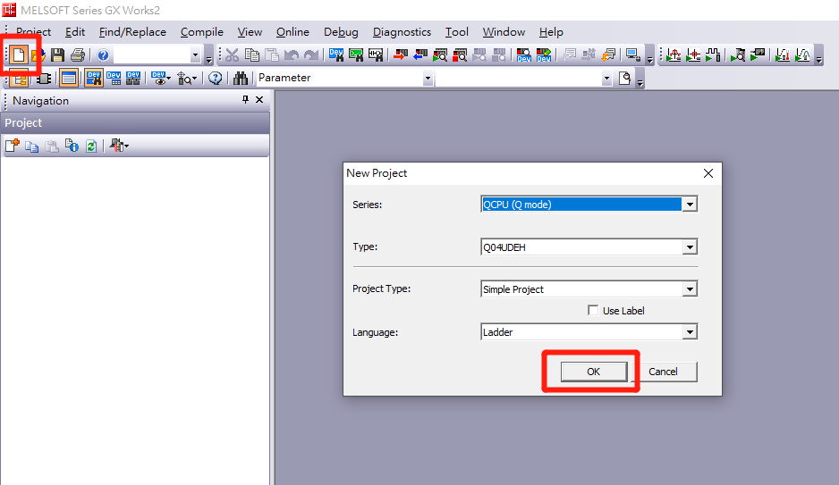

這裡來記錄一下PLC模擬器的設定方式，以及C#連接PLC的程式碼。

## Communication 設定教學
### 模擬器連線設定
1. 設定 Station Number  



2. PLC類型 選擇模擬器 GX Simulator2  


3. 設定連線名稱  


4. 完成結果  


### 透過網路連線設定
1. 選擇 網路以及連線模式


2. 設定IP



3. 設定模式 以及 CPU類型


1. 連線名稱


1. 完成結果


## GX Work2 啟動模擬器
1. 開啟新專案  



2. 開始 模擬  


## C# 開發方式
1. 加入參考 `MITSUBISHI ActMulti Control`  


2. 參考清單  


3. Coding

``` cs
var easyIf = new ActEasyIF();
easyIf.ActLogicalStationNumber = 1;
if (easyIf.Open() != 0)
    throw new Exception("連線失敗");

// Read Block (D0 ~ D49)
var buffer = new int[50];
easyIf.ReadDeviceBlock("D0", buffer.Length, out buffer[0]);

// Write Block (D0 ~ D49)
easyIf.WriteDeviceBlock("D0", buffer.Length, ref buffer[0]);

// Read Device
int value = 123;
easyIf.GetDevice("D0", out value);

// Write Device
easyIf.SetDevice("D0", value);
```