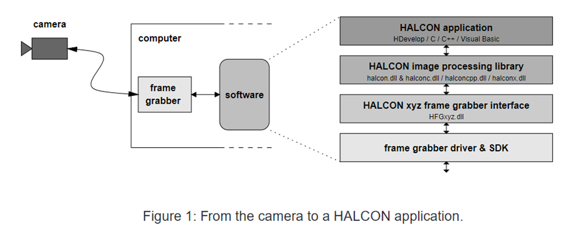
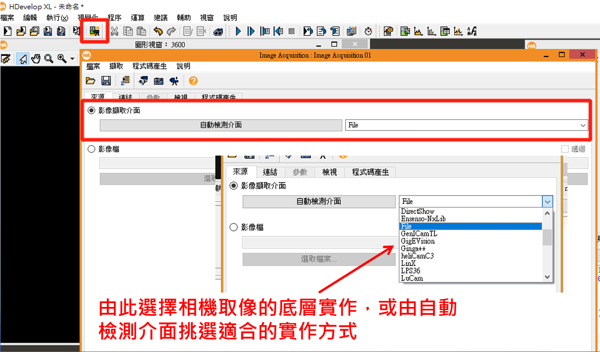
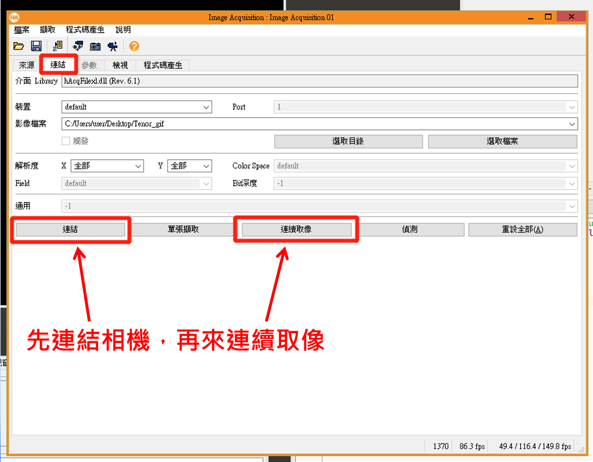
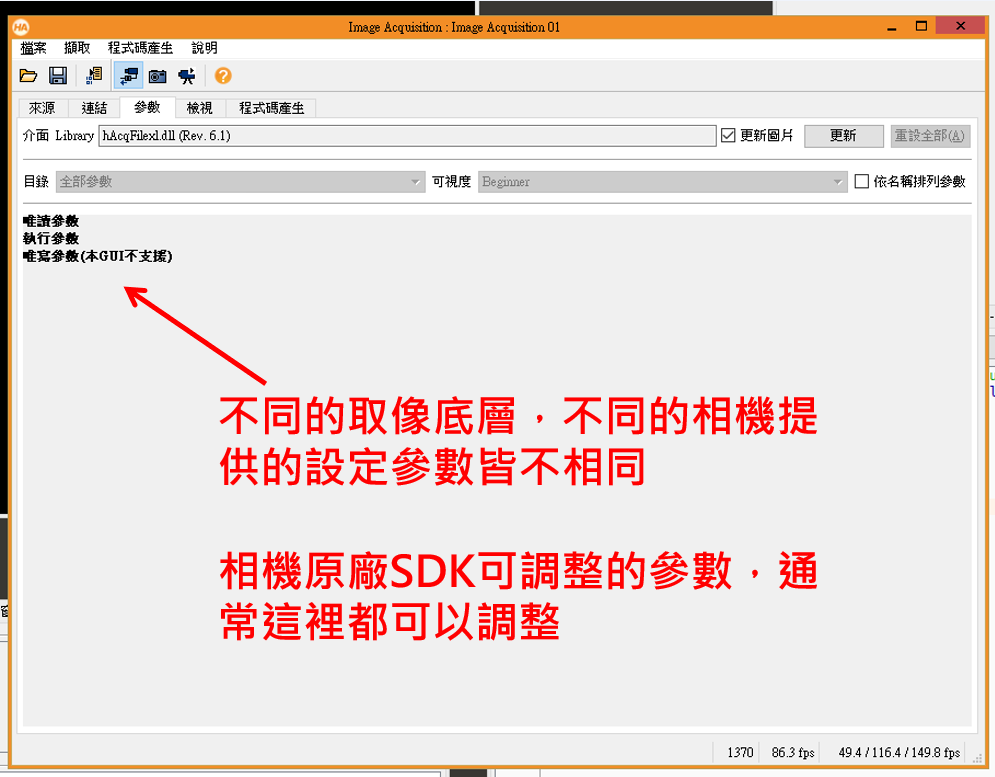
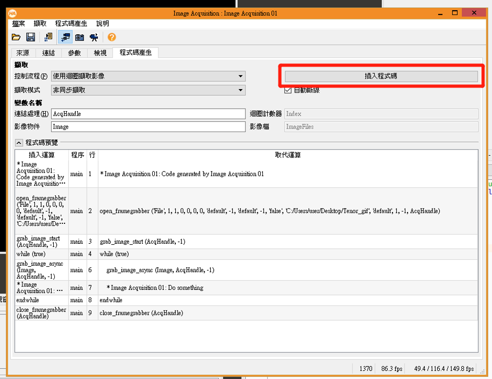
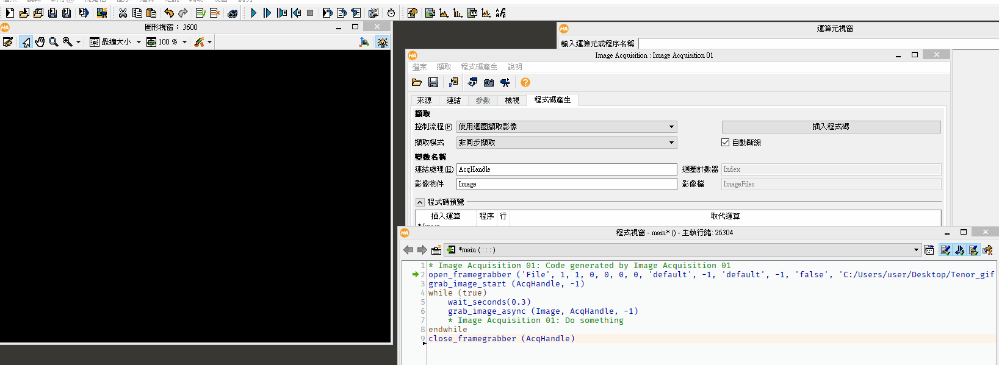
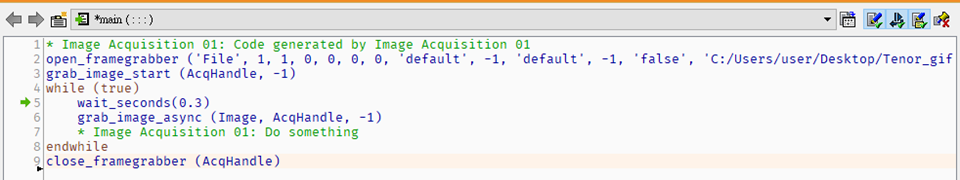
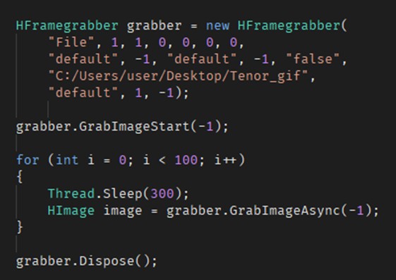
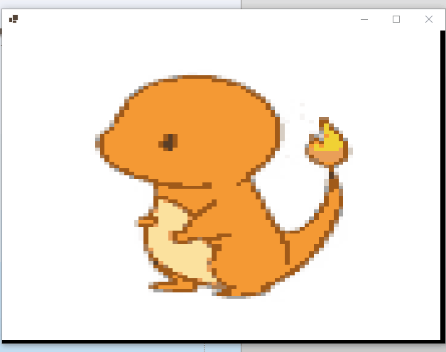

Halcon是一套付費的影像處裡函式庫，為了方便測試裡面的影像處理功能，所以她有整合了一些相機取像的功能，Halcon將軟體切成四層：

# 軟體架構
1. Halcon Application  
  這裡代表我們開發的軟體，或者`HDevlop`測試工具

2. Halcon Image Processing Library  
  這裡是我們使用的Halcon函示庫，就是`halcon.dll`  

3. Halcon xyz Frame Grabber Interface  
  Halcon做的一套中間取像的抽象層，也就是我們軟體界所說的 `interface`  

4. Frame Grabber Driver & SDK  
  這裡是實作取像功能的實作，整合不同廠牌的相機驅動，為了方便我們可以使用  



# 使用方式

* 選擇實作介面
  也可以使用自動偵測，判斷電腦本身可以使用哪些取像實作  



* 連結相機
  這裡展示就只使用`File`方式，指定資料夾內的影像，模擬相機取像的效果。  



* 相機參數設定
  這裡可以設定相機參數，例如使用`GenICamTL`，這裡就會出現`GenICamTL`參數  



* 使用範本產生程式碼



# HDevelop Demo  





# C# Demo
對於寫相機SDK有經驗的朋友可能會說，相機SDK怎麼可以沒有`取像Callback`方法呢?  
其實Halcon也有提供，但經過測試發現不是所有的實作都支援Callback方法，但如果只是要取像測試的話，這樣單張取像的方式應該也就夠用了。  




## Halcon Frame Grabber Callback
測試過 GenICamTL 有支援

``` cs
var grabber = new HFramegrabber(
    "GenICamTL", 0, 0, 0, 0, 0, 0,
    "progressive", -1, "default", -1, "false", "default",
    _deviceName, 0, -1);
grabber.SetFramegrabberParam("TriggerMode", "Off");

// 建立 相機 Callback
var callback = Marshal.GetFunctionPointerForDelegate(
    new HalconAPI.HFramegrabberCallback(HalconGrab_Callback));
grabber.SetFramegrabberCallback("LineStatus", callback, IntPtr.Zero);

grabber.GrabImageStart(-1);

private int HalconGrab_Callback(IntPtr handle, IntPtr userContext, IntPtr context)
{
    try
    {
        if (ImageGrabbed == null) return 0;

        // Get Frame Grabber Image
        var hImage = grabber.GrabImage();

        return 0;
    }
    catch (Exception ex)
    {
        //  MessageBox.Show(ex.Message);//显示错误
        return -1;
    }
}
```