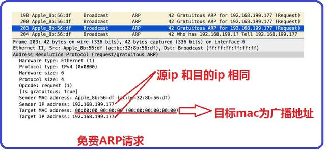
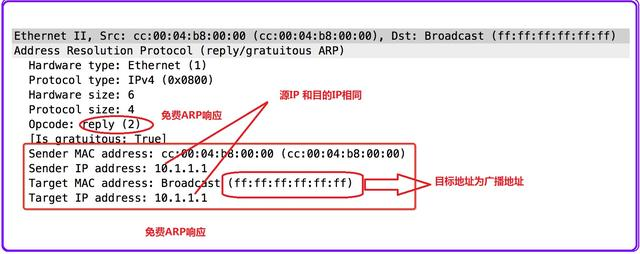

# 說明
ARP全名為`Address Resolution Protocol` （位置發現協議），在網路鏈路層上傳遞封包都需要知道目的的Mac Address，但在網路曾是使用網路層地止IP Address，所以需要透過ARP協議去廣播，詢問對方的Mac Address。

# ARP 運作
ARP運作方式相當簡單，一個是ARP 詢問（ARP Request），一個是ARP 答復（ARP Reply）。

透過發送ARP Request去廣過，區域網路上的所有電腦，詢問IP地址的MAC地址是多少，如果收到網播的電腦不是這個IP地址就會忽略它，但收到的電腦剛好是這個IP地址，就會進行ARP Reply回應自己的MAC地址。由於路由器會阻擋區域網路中的廣播封包，所以ARP只能詢問同一個網路。

每一台電腦上都有自己的ARP快取，同一個地址一段時間只會詢問一次，避免廣播風暴的發生，另外也可以使用靜態ARP設定，這樣就不需要詢問，但是這兩種方式只要重新開機都會清空。

# ARP 指令
## 查詢ARP記錄
可以利用 `arp -a` 指令來查詢電腦中所儲存的ARP記錄
```
C:\> arp -a

Interface: 192.168.1.128 --- 0x10
  Internet Address      Physical Address      Type
  192.168.1.1           c0-06-c3-3b-5b-ec     dynamic
  192.168.1.255         ff-ff-ff-ff-ff-ff     static
  224.0.0.2             01-00-5e-00-00-02     static
  224.0.0.22            01-00-5e-00-00-16     static
  224.0.0.251           01-00-5e-00-00-fb     static
  224.0.0.252           01-00-5e-00-00-fc     static
  239.255.255.250       01-00-5e-7f-ff-fa     static
```
## 新增靜態APR記錄
利用 `arp -s <IP地址> <MAC地址>` 新增靜態地址

```
C:\> arp -s 203.74.205.42 00-00-e8-97-73-86
```
## 刪除APR記錄
可利用 `arp -d` 刪除全部或 `arp -d <IP地址>` 刪除指定IP的方式。

```
C:\> arp -d 192.168.28.36
```

# ARP 攻擊
由於APR的機制會去詢問網路上的設備，有詢問就會有欺騙，使用者的電腦和路由器都有各自的ARP資料，會互相記錄對方的IP與MAC地址，駭客攻擊方會發ARP指令給雙方，讓雙方的APR資料中的MAC地址都變成駭客電腦地址，駭客就會收到雙方所有的封包資料。

## 應對方式
只要不使用http、ftp、telnet等這類以明文傳送的協定，改使用https、sftp、ssh等這類經過加密過的協定，就算封包經過駭客手中，也無法解析裡面資料。

---
# Gratuitous ARP

也稱為 免費的ARP、無故的ARP，GARP與一般ARP不同的地方在於，並非想要得到目標IP對應的MAC，而是主機啟動時，發送GARP，**請求自己的 IP地址的MAC**，就好像自問自答

## 目的
1. 以廣播的形式告訴大家自己的IP與MAC，不期望得到回應

3. 藉由此方法發現發現有沒有其他人使用此IP，如果有人回應則代表**IP衝突**

3. 也順便藉由此方式更新自己的MAC給其他設備，預防自己換網卡(MAC)

## GARP 請求 與 回應

發送免費ARP，我要使用XX地址，請問有人使用嗎?使用的人請你告訴我。
* 來源IP 與 目標IP 地址相同
* 目標MAC是廣播MAC



如果有人回應，我正在使用地址XXX，就代表發生IP衝突
* 來源IP 與 目標IP 地址相同
* 目標MAC為廣播MAC



## 資料來源
[免費ARP與IP位址衝突](https://kknews.cc/zh-tw/code/ezm9vvy.html)
