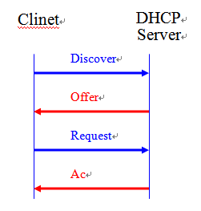
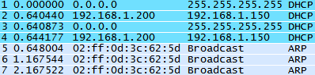
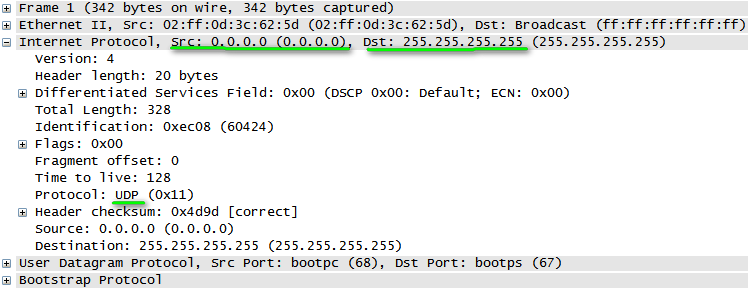
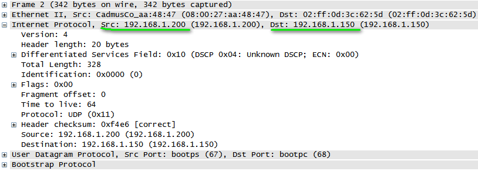
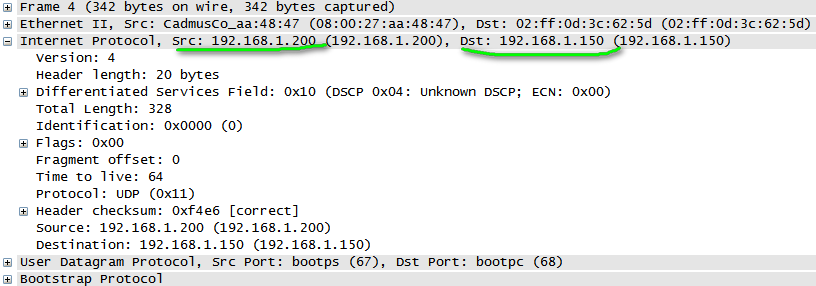

DHCP (Dynamic Host Configuration Protocol)

DHCP為動態主機設定協定，為了避免發生內網上的IP地址重複發生IP衝突，每當有網路設備要連線時會向DHCP伺服器請求IP地址，由DHCP Server找出尚未使用的IP地址分配給網路設備，同一個區網盡可能只配置一個DHCP Server，如果需要多個DHCP服務器需要分別設定不衝突的派發範圍，避免發生IP地址衝突的情況。

### 步驟

| Client | Method                                      | Direction | DHCP |
| ------ | ------------------------------------------- | --------- | ---- |
| Client | Discover (尋找區網內的DHCP Server)            | ->        | DHCP |
| Client | Offer (DHCP 分配一組IP地址與租約 給 客戶端)     | <-        | DHCP |
| Client | Request (告訴DHCP，我使用你的地址)             | ->        | DHCP |
| Client | Ack (DHCP回應此地址租約正式生效)                | <-        | DHCP |

### 封包觀察

* DHCP Discover

  設備剛上線沒有IP地址，所以Source IP為0.0.0.0，不知道DHCP在哪裡，所以是廣播封包  

  

* DHCP Offer

  DHCP 伺服器收到請求(192.168.1.200)，發送一組IP為192.168.1.150給目標MAC地址

  

* DHCP Request

  Client端可能同時收到多個Offer指令，這時候Client會採用第一個Offer指令的資料，發送廣播告訴大家自己要採用哪一個Offer。

  並且會再發送GARP測試看看是否有人在使用這組IP，如果發現衝突，則會發送 Decline給DHCP伺服器取消申請，重新再發Discover

  

* DHCP Ack

  DHCP 伺服器回應OK，IP地址租約正式開始

  

# 資料來源
[DHCP協定 (ncut.edu.tw)](https://irw.ncut.edu.tw/peterju/course/network/971/doc/homework/07/DHCP.html)