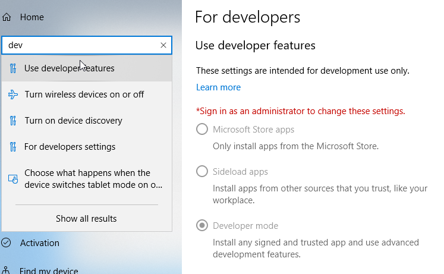
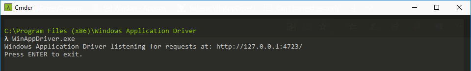
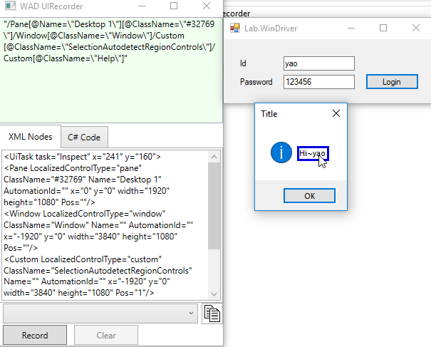
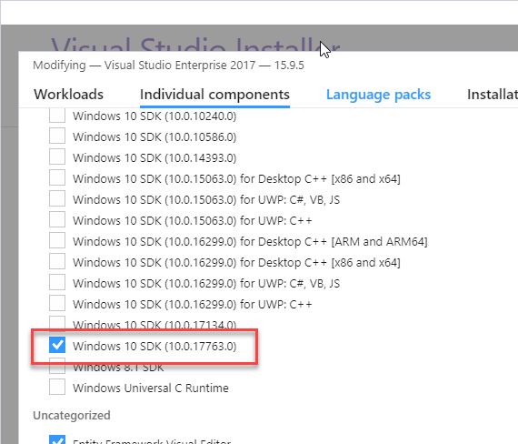
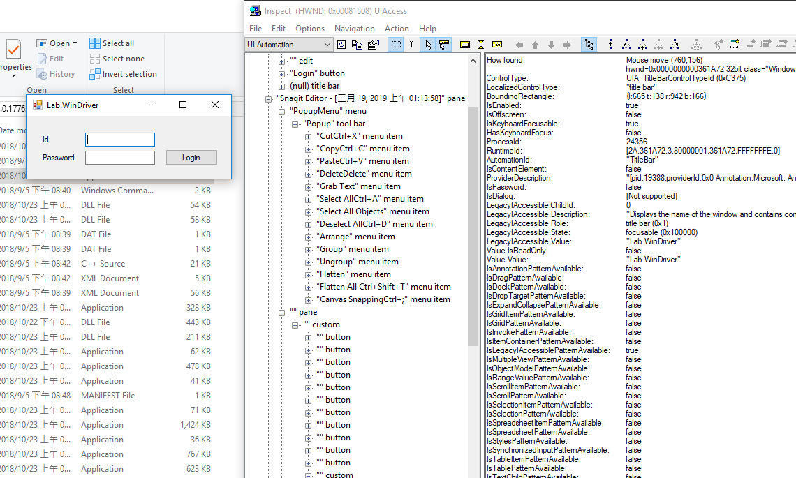

Selemium 是測試Web UI的測試工具，可以遙控瀏覽器模擬人工行為，達到UI測試功能，Windows Desktop上是否也有此功能，那就是 Appium 了。

# 環境相依
* 開啟 Windows 開發者模式



* 安裝 [WinAppDriver](https://github.com/Microsoft/WinAppDriver/releases)
> 使用管理員權限開啟`C:\Program Files (x86)\Windows Application Driver\WinAppDriver.exe`  
> 並記錄 `http://127.0.0.1:4723/`下來，待會測試時需要使用此網址  



# 工具
* WinAppDriver UI Recorder
錄製UI操作轉成程式碼或查看XPath
> 下載並執行[WinAppDriver UI Recoder](https://github.com/Microsoft/WinAppDriver/releases)



* 安裝 Windows 10 SDK
inspect.exe可以查看應用程式內控制項代號

> C:\Program Files (x86)\Windows Kits\10\bin\10.0.xxxxx.0\x64\inspect.exe





# Appium WebDriver
首先先安裝 `Appium.WebDriver`
> dotnet package add Appium.WebDriver

## 小算盤測試
``` cs
public class CalculatorTests
{
    private WindowsDriver<WindowsElement> WindowsDriver;

    [SetUp]
    public void Setup()
    {
        var appiumOptions = new AppiumOptions(){};

        // 如果是 UWP 輸入 Packet Id，如果是 Desktop 則輸入exe路徑
        appiumOptions.AddAdditionalCapability("app", "Microsoft.WindowsCalculator_8wekyb3d8bbwe!App");

        // 連接 WindowDriver Url
        WindowsDriver = new WindowsDriver<WindowsElement>(new Uri("http://127.0.0.1:4723"), appiumOptions);
        
        WindowsDriver.Manage().Timeouts().ImplicitWait = TimeSpan.FromSeconds(3);
        WindowsDriver.Manage().Window.Maximize();
    }

    [Test]
    public void CalculatorTest()
    {
        WindowsDriver.Keyboard.SendKeys("2");
        WindowsDriver.Keyboard.SendKeys("+");
        WindowsDriver.Keyboard.SendKeys("3");
        WindowsDriver.Keyboard.SendKeys("=");
        WindowsDriver.FindElementByAccessibilityId("CalculatorResults")
            .Text
            .Should()
            .Be("Display is 5");
    }

    [TearDown]
    public void TearDown()
    {
        WindowsDriver.Quit();
        WindowsDriver.Dispose();
    }
}
```

[範例程式](https://github.com/patrick85081/WinAppDriverTestSample)

# 參考資料
[Appium + WinAppDriver 測試 Windows 桌面應用程式 UI](https://www.dotblogs.com.tw/yc421206/2019/03/19/via_Appium_and_WinAppDriver_UI_Test_Automation_on_Windows_Applications)
