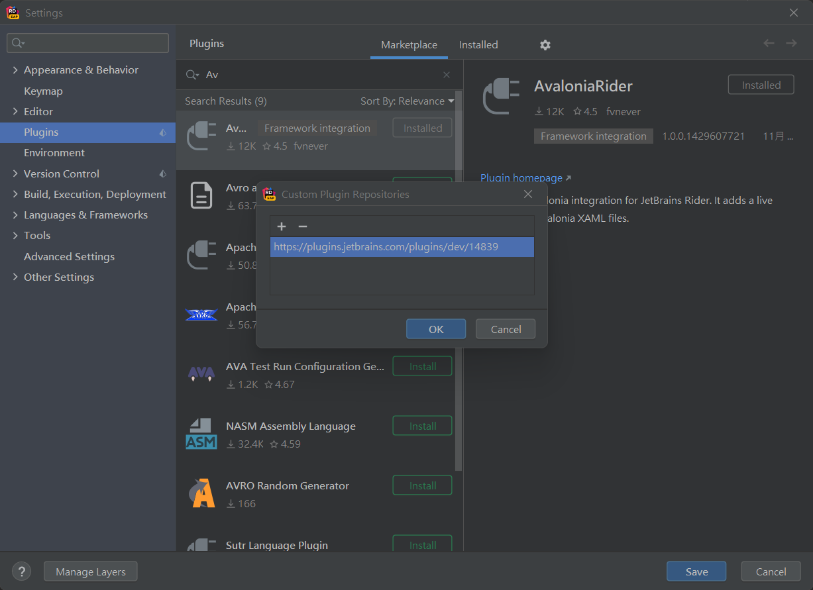

# 前言
從.Net Framework到.Net，微軟的C#終於可以跨平台，跑在Linux、Docker Container，但是桌面應用程式WinForm、WPF依然只能Windows，然而有個開源項目Avalonia卻是以WPF的風格做出跨平台的桌面應用程式，雖然在各方面都還不構成熟，我們期待它未來的發展。

# 環境建置

## Dotnet 樣板

- 下載樣板
    [Avalonia Dotnet Template](https://github.com/AvaloniaUI/avalonia-dotnet-templates)
    
- 安裝樣板
    
> dotnet new –install \[path-to-repository\]

- Avalonia 樣板

| 範本名稱 | 簡短名稱 | 語言     | 標記     |
| --- | --- | --- | --- |
| Avalonia .NET Core App   | avalonia.app | [C#],F# | ui/xaml/avalonia/avaloniaui |
| Avalonia .NET Core MVVM App | avalonia.mvvm | [C#],F# | ui/xaml/avalonia/avaloniaui |
| Avalonia UserControl | avalonia.usercontrol | [C#],F# | ui/xaml/avalonia/avaloniaui |
| Avalonia Window | avalonia.window | [C#],F# |  ui/xaml/avalonia/avaloniaui |
| Avalonia TemplatedControl | avalonia.templatedcontrol | [C#] | ui/xaml/avalonia/avaloniaui |
| Avalonia Resource Dictionary | avalonia.resource | | ui/xaml/avalonia/avaloniaui |
| Avalonia Styles | avalonia.styles | |               ui/xaml/avalonia/avaloniaui |

* 參考資料
[Avalonia Hello World](https://www.lingmin.me/2020/04/30/AvaloniaHelloWorld/)
## IDE擴充套件

- Visual Studio
    [Avalonia for Visual Studio](https://marketplace.visualstudio.com/items?itemName=AvaloniaTeam.AvaloniaforVisualStudio)
    
- JetBrains Rider
    1. 加入 Plugin Repository `https://plugins.jetbrains.com/plugins/dev/14839`

    

    2. 安裝 AvaloniaRider
    [AvaloniaRider](https://plugins.jetbrains.com/plugin/14839-avaloniarider)

---
# 教學文檔
[AvaloniaUI Doc](https://docs.avaloniaui.net/docs/getting-started/programming-with-avalonia)

[一起學習 Avalonia](https://blog.csdn.net/jinyuttt/category_10038673.html)

[Avalonia 社群資料整理](https://github.com/AvaloniaCommunity/awesome-avalonia)

[ReactiveUI Doc](https://www.reactiveui.net/docs/getting-started/)

[reactive progamming dot net](https://github.com/blackie1019/reactive-progamming-dot-net)

# XAML標記x:Name不能用
開始正常使用後會發現第一個問題，以前在寫WPF時候，幫控制項取變數名稱的`x:Name="MyName"`，Window內就可直接調用不管用了

* 第一種方法 (原生)
可以在 Window/UserControl中使用`Find<T>(name)`取得
``` cs
this.Find<TextBlock>("txt");
```

* 第二種方法
改成使用`Source Generator`的方式來做，需要另外安裝Nuget包`XamlNameReferenceGenerator`

> dotnet add package XamlNameReferenceGenerator

套件GitHub : [Avalonia.NameGenerator](https://github.com/AvaloniaUI/Avalonia.NameGenerator)

* 參考資料
[Avaloniaui奇怪问题记录之x:Name用不了](https://www.bilibili.com/read/cv11136600)

# MessageBox不見了
在AvaloniaUI裡面沒有MessageBox，大概是只要自己用Window做一做就好所以就沒內建，5這裡有其他人做的簡易MessageBox
> dotnet add package MessageBox.Avalonia

套件GitHub : [MessageBox.Avalonia](https://github.com/AvaloniaCommunity/MessageBox.Avalonia)

``` cs
var messageBoxStandardWindow = MessageBox.Avalonia.MessageBoxManager
	.GetMessageBoxStandardWindow(
		"Title",
		"Show MessageBox Content");
await messageBoxStandardWindow.Show(); //ShowDialog(windows);
```

# Design DataContext
在 Avalonia 不支援 `d:DesignInstance`，所以設計時候的DataContext要改寫法

以前在WPF 可以寫
``` xml
<Window
	d:DataContext="{d:DesignInstance local:MyDesignViewModel, IsDesignTimeCreatable=true}"
	>
</Window>
```

在 Avalonia 要寫
* 方法一 靜態方式取得，需要事先塞好測試資料
``` xml
<Window
	d:DataContext="{x:static local:MyDesignData.MyViewModel}"
	>
</Window>
```
``` cs
public class MyDesignData
{
	public static MyViewModel MyViewModel => new MyViewModel(){ Title = "MyTitle" };
}
```

* 方法二 設計時去產生資料，可在View塞資料
``` xml
<Window
	>
	<Design.DataContext>
		<local:DesignViewModel Title="MyTitle"/>
	</Design.DataContext>
</Window>
```

## 參考資料
* [Design-Time Properties](https://docs.avaloniaui.net/docs/getting-started/ide-support)
* [Add support for d:DesignInstance when using d:DataContext in designer #2445](https://github.com/AvaloniaUI/Avalonia/issues/2445)
* [How to set DataContext in own UserControl? #2121](https://github.com/AvaloniaUI/Avalonia/issues/2121)

---
# Behavor
> dotnet add package Avalonia.Xaml.Behaviors

套件GitHub : [AvaloniaBehaviors](https://github.com/wieslawsoltes/AvaloniaBehaviors)

### EventToCommand
``` xml
<UserControl x:Class="BehaviorsTestApplication.Views.Pages.EventTriggerBehaviorView"
             xmlns="https://github.com/avaloniaui"
             xmlns:x="http://schemas.microsoft.com/winfx/2006/xaml"
             xmlns:i="using:Avalonia.Xaml.Interactivity"
             xmlns:ia="using:Avalonia.Xaml.Interactions.Core"
             xmlns:d="http://schemas.microsoft.com/expression/blend/2008"
             xmlns:mc="http://schemas.openxmlformats.org/markup-compatibility/2006"
             xmlns:vm="using:BehaviorsTestApplication.ViewModels"
             x:CompileBindings="True" x:DataType="vm:MainWindowViewModel"
             mc:Ignorable="d" d:DesignWidth="600" d:DesignHeight="450">
  <Design.DataContext>
    <vm:MainWindowViewModel />
  </Design.DataContext>
  <Grid RowDefinitions="Auto,Auto">
    <TextBox Name="TextBox" Text="Hello" Grid.Row="0" Margin="5" />
    <Button Name="ChangeProperty" Content="Change Property" Grid.Row="1" Margin="5,0,5,5">
      <i:Interaction.Behaviors>
        <ia:EventTriggerBehavior EventName="Click" SourceObject="{Binding #ChangeProperty}">
          <ia:ChangePropertyAction TargetObject="{Binding #TextBox}" PropertyName="Text" Value="World" />
		  <ia:InvokeCommandAction Command="{Binding MyCommand}" />
        </ia:EventTriggerBehavior>
      </i:Interaction.Behaviors>
    </Button>
  </Grid>
</UserControl>
```

---
# DI
[ReactiveUI Splat](https://github.com/reactiveui/splat)

## 替換其他 DI
* Autofac
> dotnet add package Splat.Autofac

來源：[Splat.Autofac](https://www.nuget.org/packages/Splat.Autofac/) 

* DryIoc
> dotnet add package Splat.DryIoc

來源：[Splat.DryIoc](https://www.nuget.org/packages/Splat.DryIoc/)

* Microsoft.Extensions.DependencyInjection
> dotnet add Splat.Microsoft.Extensions.DependencyInjection

來源：[Splat.Microsoft.Extensions.DependencyInjection](https://www.nuget.org/packages/Splat.Microsoft.Extensions.DependencyInjection/)

* Ninject
> dotnet add package Splat.Ninject

來源：[Splat.Ninject](https://www.nuget.org/packages/Splat.Ninject/)

* SimpleInjector
> dotnet add package Splat.SimpleInjector

來源：[Splat.SimpleInjector](https://www.nuget.org/packages/Splat.SimpleInjector/)


## 更換DI後的注意事項

[When you replace dependency injection with autofac, showdialog will report an error](https://github.com/AvaloniaUI/Avalonia/issues/5298)

---
# ReactiveUI Route
skip

---
# UI Live Reload
如果要達到 .Net 6 一樣的 Live Reload，可以透過這個涵式庫，基本上是重用ViewModel，但是UI重新產生。  
[Live.Avalonia](https://github.com/AvaloniaCommunity/Live.Avalonia)

# 現成UI主題套件
* [Material.Avalonia](https://github.com/AvaloniaCommunity/Material.Avalonia)

* [Citrus.Avalonia](https://github.com/AvaloniaCommunity/Citrus.Avalonia)

* [Avalonia.FuncUI](https://github.com/fsprojects/Avalonia.FuncUI)


# UI控制項套件
* [Avalonia.Microcharts](https://github.com/AvaloniaCommunity/Avalonia.Microcharts)
