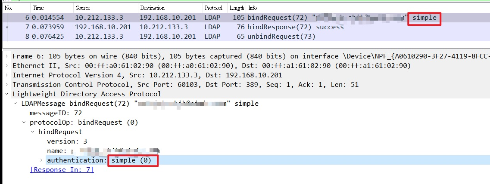
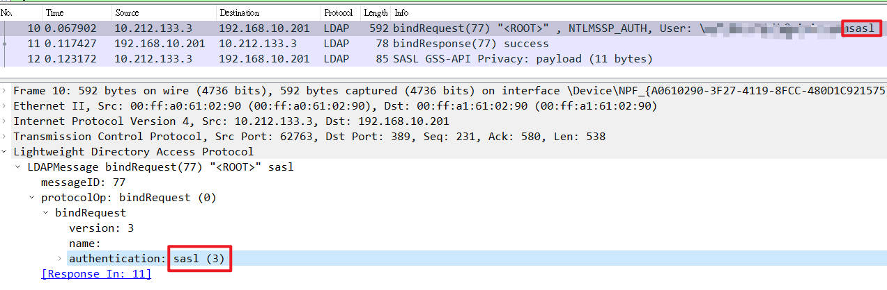

# Ldap 連線
之前接手的程式碼是使用`DirectoryEntry`來做Ldap連線，但一直試不出來Ssl連線，後來查了一下，原來可以使用`LdapConnection`，這裡來記錄一下它的使用方式。

## Nuget 安裝
> dotnet add package System.DirectoryServices.Protocol

## Simple Bind
``` cs
var ldap = new LdapConnection("192.168.10.201:389");
ldap.AuthType = AuthType.Basic;
ldap.SessionOptions.ProtocolVersion = 3;
// 登入
ldap.Bind(new NetworkCredential("Account", "Password"));
```


## Sasl
``` cs
var ldap = new LdapConnection("192.168.10.201:389");
// Sasl
ldap.AuthType = AuthType.Negotiate;
ldap.SessionOptions.ProtocolVersion = 3;
//ldap.SessionOptions.Signing = true;
//ldap.SessionOptions.Sealing = true;
// 登入
ldap.Bind(new NetworkCredential("Account", "Password"));
```



## SSL 
``` cs
var ldap = new LdapConnection("192.168.10.201:636");
ldap.AuthType = AuthType.Basic;
ldap.SessionOptions.ProtocolVersion = 3;
// SSL
ldap.SessionOptions.SecureSocketLayer = true;
// 略過 憑證檢查
ldap.SessionOptions.VerifyServerCertificate = (con, cert) => true;
// 登入
ldap.Bind(new NetworkCredential("Account", "Password"));
```

## Sasl + SSL
``` cs
var ldap = new LdapConnection("192.168.10.201:636");
// Sasl
ldap.AuthType = AuthType.Negotiate;
ldap.SessionOptions.ProtocolVersion = 3;
// SSL
ldap.SessionOptions.SecureSocketLayer = true;
// 略過 憑證檢查
ldap.SessionOptions.VerifyServerCertificate = (con, cert) => true;
// 登入
ldap.Bind(new NetworkCredential("Account", "Password"));
```

---
# 資料查詢
``` cs
var response = ldap.SendRequest(new SearchRequest(
    "DC=pixis,DC=com",
    "(objectclass=domain)",
    SearchScope.Subtree)
) as SearchResponse;

foreach (var entry in response.Entries.Cast<SearchResultEntry>())
{
    var distinguishedName = entry.DistinguishedName;
    var rawData = entry.Attributes["name"].GetValues(typeof(byte[]))[0] as byte[];
    var name = Encoding.Default.GetString(rawData);

    Console.WriteLine();
    Console.WriteLine(distinguishedName);
    Console.WriteLine(name);
}
```