今天來研究一下，SQL Server如何使用SSL加密連線，保護資料的安全性。

# mmc 產生憑證
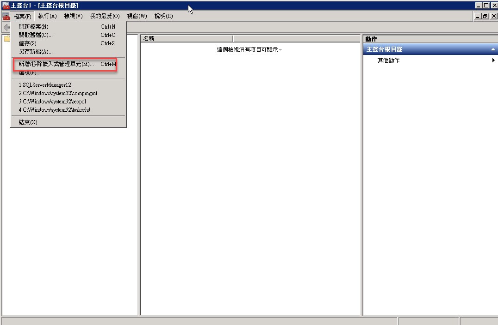
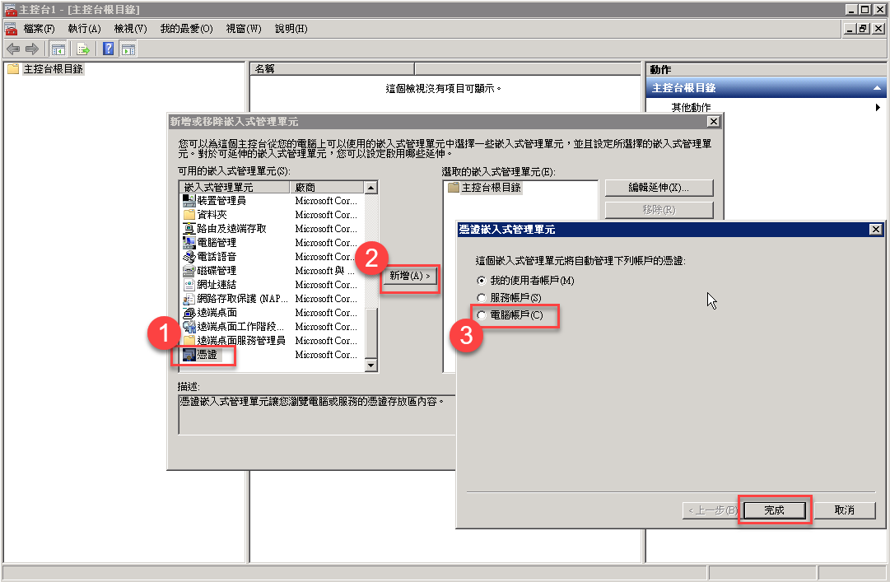
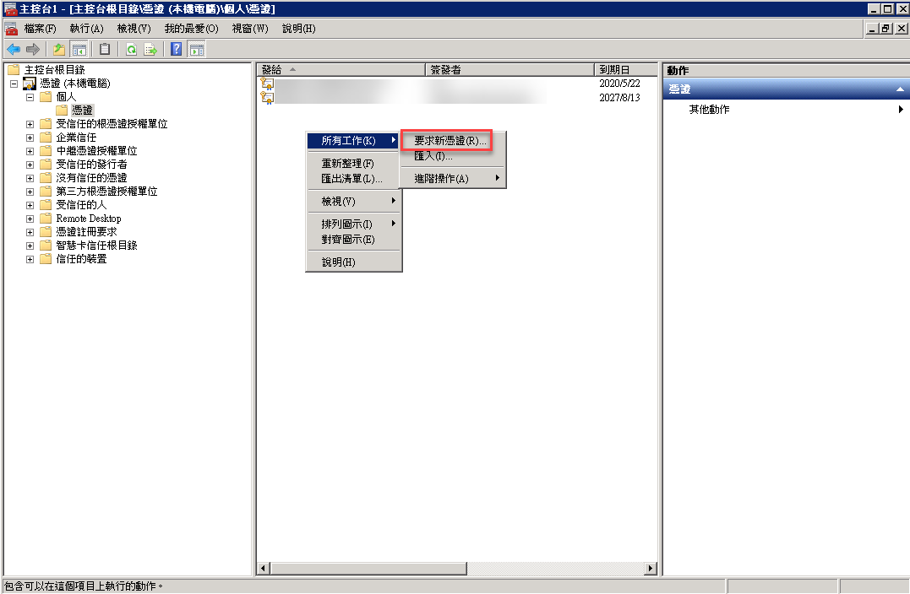
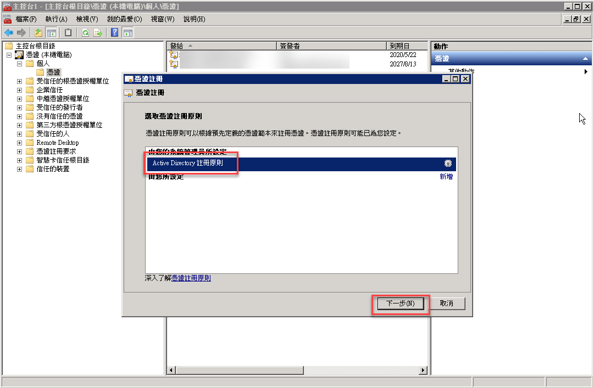
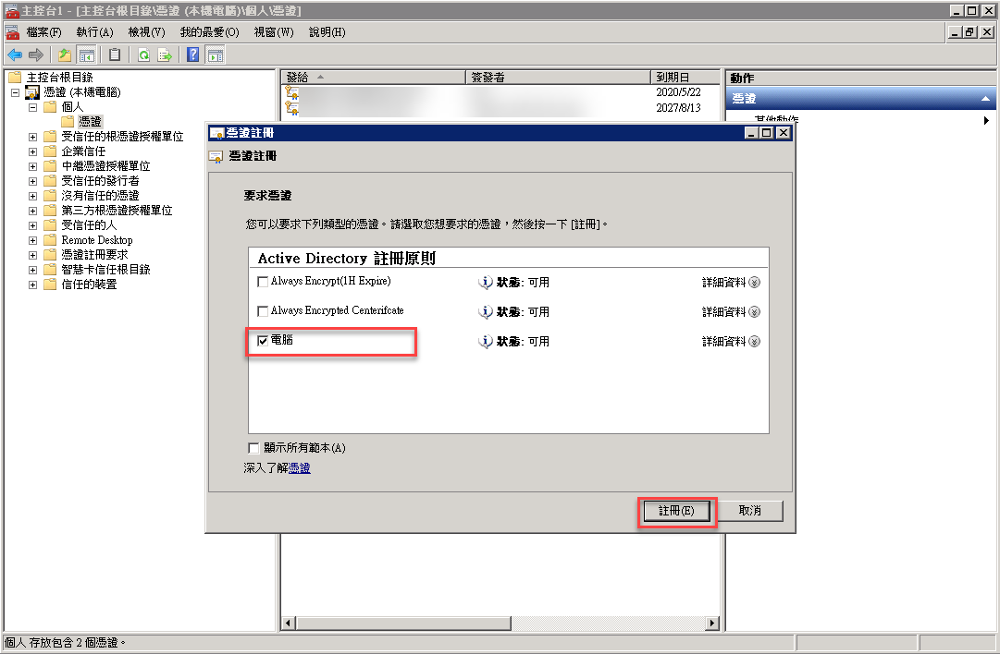

# SQL Server 使用SSL憑證
開啟 SQL Server 組態管理員

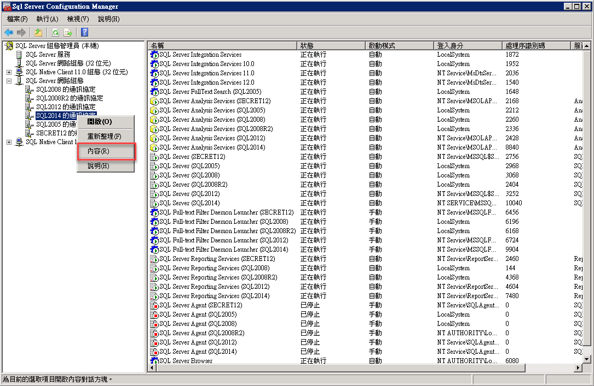

* 強制加密
  - 是：Client 一律使用加密連線
  - 否：由 Client 決定是否加密

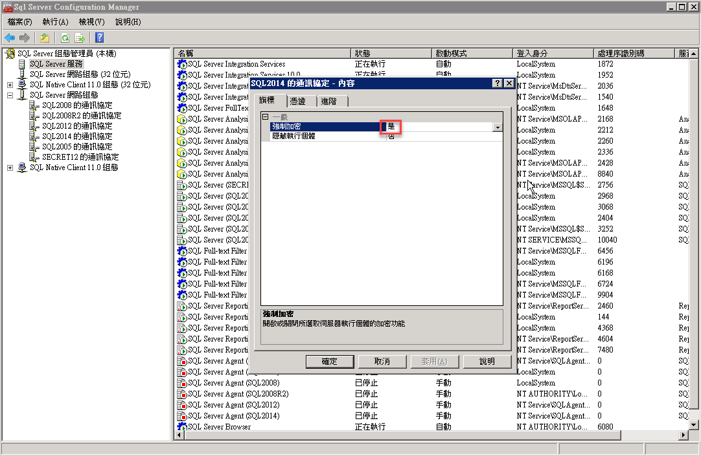
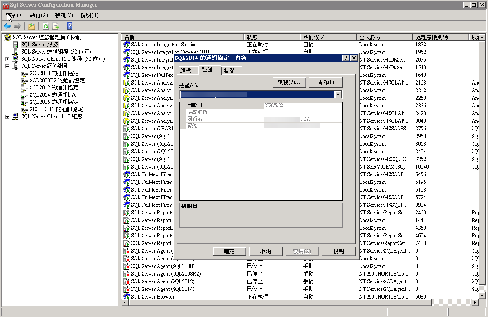
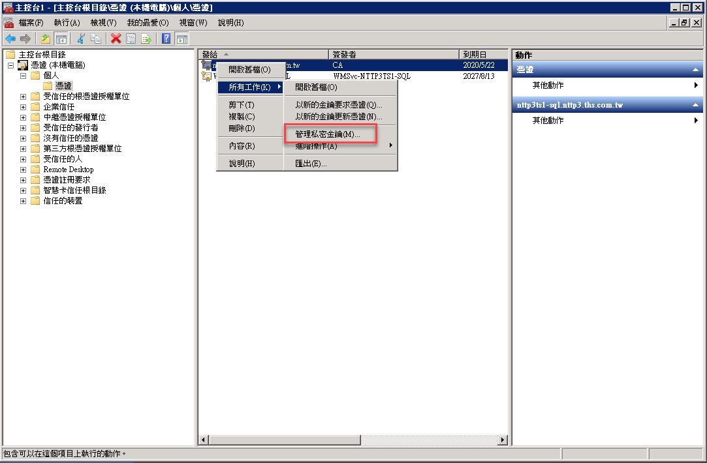

增加 `NT Service\MSSQLSERVER` 使用憑證權限
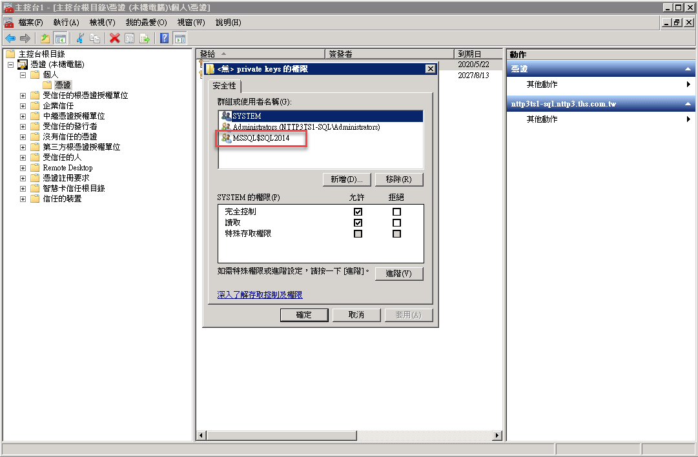

重啟 SQL Server

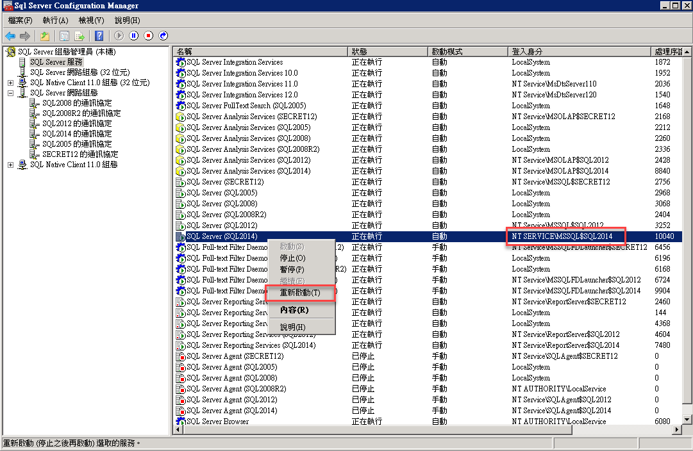

# Client 連線
* Encrypt connection
  使用加密連線 (對應連線字串 `Encrypt=True`)

* Trust server certificate
  信任憑證  (對應連線字串 `TrustServerCertificate=True`)

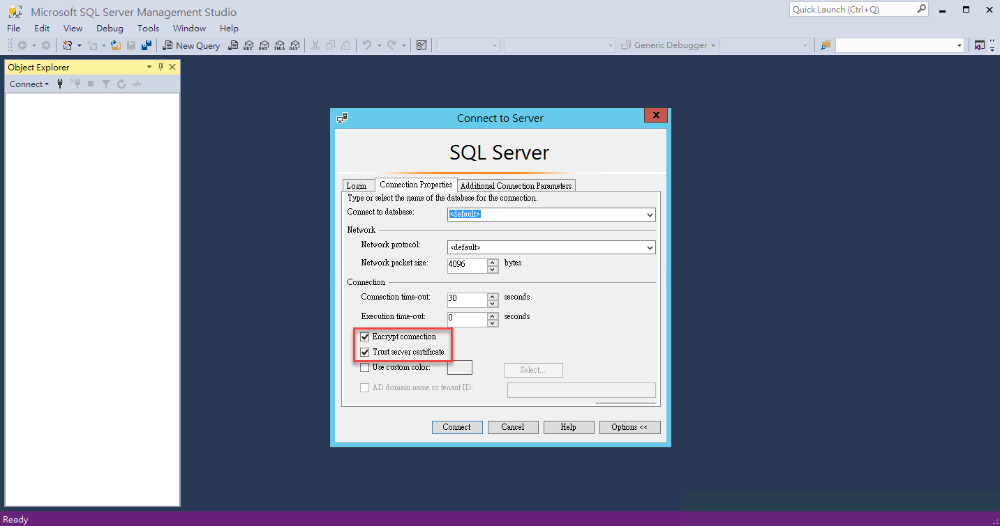

# 驗證是否加密
使用`Wireshark` 使用 **TDS** 過濾
看不到 **SQL Batch** 就代表加密成功

# 參考資料
[啟用 SQL Server SSL 連線加密](https://dotblogs.com.tw/yc421206/2019/05/23/enable_sql_server_ssl_connection_encrypt)