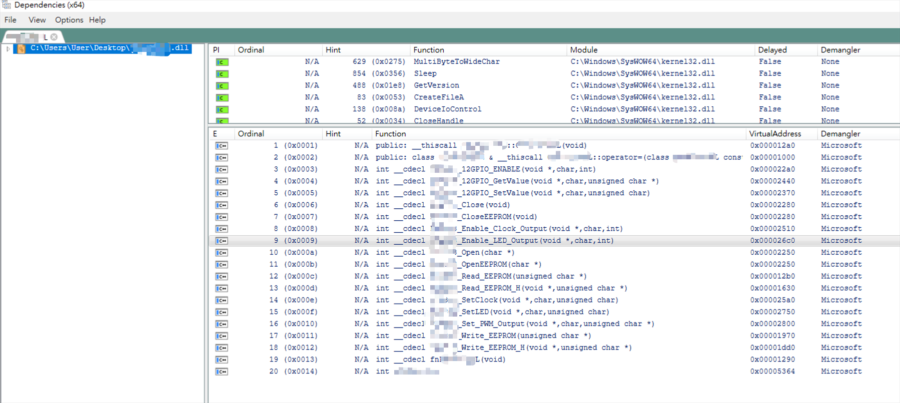
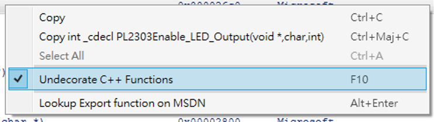
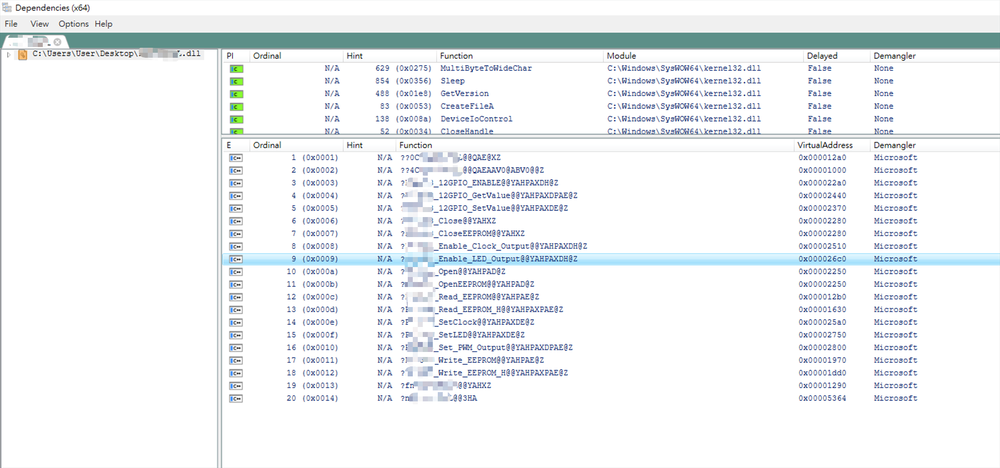
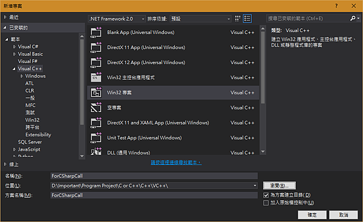
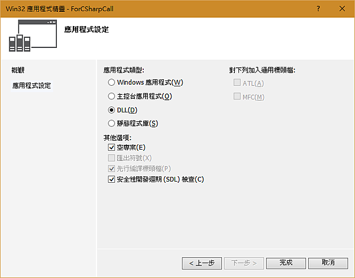
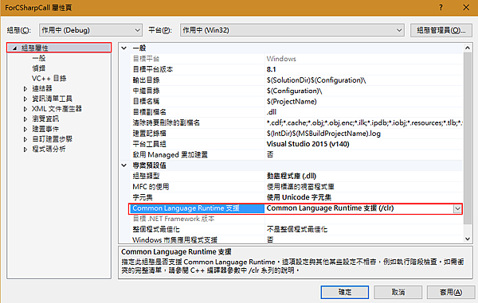
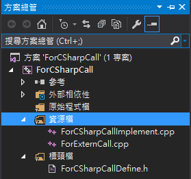

很多場景都需要與`C/C++ Library`溝通做朋友，當 C# 需要呼叫 C/C++ 程式庫時，需要使用`PInvoke`(Platform Invocation Services)，來呼叫裡面的function，常用到的場景是呼叫Windows原生地`Win32API`，或是使用硬體SDK時只提供C 函式庫，這裡也有好幾種狀況與方式，紀錄一下方便可以快速了解。

# 靜態呼叫
使用C#的`DllImport`去匯入C語言function，例如在`user32.dll`中的`MessageBox`，這時候要先了解裡面的資料型態該如何去對應C#資料型態。

* `MessageBox`在`user32.dll`宣告長這樣:  
``` c
MessageBox(HWND hWnd, LPCSTR lpText, LPCSTR lpCaption, UINT uType);  
```

* 使用C# 呼叫
``` c#
using System;
using System.Runtime.InteropServices;

[DllImport("user32.dll")]
private static extern int MessageBox(IntPtr hWnd, String text, String caption, int type);

public static void Main()
{
    MessageBox(IntPtr.Zero, "Text", "Caption", 0);
}
```

## C struct 的對應
還有一種情況，C function中使用的類型不是基本型別，是額外定義的型別，我們也需要定義對應的C# 物件來接收，就拿 `Kernal32.dll`中的 `GetSystemTime`來說

``` c
void GetSystemTime(LPSYSTEMTIME lpSystemTime);

typedef struct _SYSTEMTIME {
  WORD wYear;
  WORD wMonth;
  WORD wDayOfWeek;
  WORD wDay;
  WORD wHour;
  WORD wMinute;
  WORD wSecond;
  WORD wMilliseconds;
} SYSTEMTIME, *PSYSTEMTIME;
```
要呼叫這個function，我們必須定義一個C#的Class和C Struct有一樣的結構，而且成員的順序也需要相同。
``` cs
using System;
using System.Runtime.InteropServices;     

[StructLayout(LayoutKind.Sequential)]
public class SystemTime 
{
   public ushort year;
   public ushort month;
   public ushort weekday;
   public ushort day;
   public ushort hour;
   public ushort minute;
   public ushort second;
   public ushort millisecond;
}
```

``` cs
[DllImport("Kernel32.dll")]
public static extern void GetSystemTime(SystemTime st);

public static void Main()
{
    SystemTime t = new SystemTime();
    GetSystemTime(t);
    Console.WriteLine(t.Year);
}
``` 
這裡有一個網站可以查詢常用的 Windows API 怎麼對應 C#的寫法。  
[PInvoke.Net](http://www.pinvoke.net/)

---
# 動態呼叫
還有一種作法可以執行的時候才動態去連結指定的function，這種作法寫起來較為麻煩，但是適合的場景為硬體SDK同時提供 `x86`和 `x64`的 C API，那我們要包裝成C#時可以動態根據程式架構去連結/調用相對應的API，將讀進來的C function用相對應的`C# delegate(function point)`來接收，使用時只要呼叫delegate就可以。
``` cs
[DllImport("kernel32", CharSet = CharSet.Unicode, SetLastError = true)]
static extern IntPtr LoadLibrary(string lpFileName);

[DllImport("kernel32", SetLastError = true)]
static extern bool FreeLibrary(IntPtr hModule);

[DllImport("kernel32", CharSet = CharSet.Ansi, SetLastError = true, ExactSpelling = false)]
static extern IntPtr GetProcAddress(IntPtr hModule, string lpProcName);

// 定義對應的 C Function 的 函式指標
delegate void DelegateGetSystemTime(SystemTime st);

void Main(string args[])
{
    // 讀取 C dll
    var lib = LoadLibrary("Kernel32.dll");

    // load function to c# function point (delegate)
    var getSystemTime = (DelegateGetSystemTime) 
        Marshal.GetDelegateForFunctionPointer(
            GetProcAddress(lib, "GetSystemTime"), 
            typeof(DelegateGetSystemTime));

    // 調用
    SystemTime tt = new SystemTime();
    getSystemTime(tt);

    // 釋放 C dll
    FreeLibrary(lib);
}
```

---
# 查詢 C function的 EntryPoint
通常 C function的方法名稱就是`EntryPoint`，所以`DllImport`沒有指定`EntryPoint`時就會使用方法名稱作為`EntryPoint`，但是筆者這裡也有碰過硬體廠商提供的C API沒有遵守這個規則，去做對應時候要額外指定`EntryPoint`，偏偏說明書又沒有告訴你它的`EntryPoint`，筆者沒有寫過C語言，裡面的原因沒有深入去了解，不過有一套工具可以去查詢C function對應的EntryPoint，它叫做[Dependencies](https://github.com/lucasg/Dependencies)。  

利用`Dendencies`開啓C dll後，可以看到這個dll相依其他的dll，還有他的function清單，就像前面說的一般的function都會跟EntryPoint相同。


這時候按下右鍵，`Undecoderate C++ Function`取消。


所有的function就原形畢露了，EntryPoint是 **?** 開頭，**@@YAHPAXPAE@Z** 結尾。


這個時候就能成功的對應function了。
``` cs
[DllImport("****.dll", EntryPoint = "?****_12GPIO_SetValue@@YAHPAXDE@Z", SetLastError = true, CharSet = CharSet.Unicode)]
private static extern int ****_12GPIO_SetValue(IntPtr hdrv, int GPIO_Num, bool val);
```

---
# 實際寫一個 C++ Library 來讓 C# 呼叫
讓我們實際寫一個 C++ Library來讓 C# 呼叫，這樣就能了解到雙方的溝通原理。  

* 新增 C++ Win32專案


* 選擇程式類型


* 設定專案 CLR 支援


* 實際寫一個 C++ Library  
  宣告C++物件 `Calculate`
``` c
// Calculate.h
#pragma once
class Calculate
{
public:
    Calculate();

    int Addition(int a, int b);//加法

    int Subtraction(int a, int b);//剪髮

    void RegisterCallback(void(*callback)(int, int, int, int));// 註冊函式指標，作為Callback Function
};
```

``` c
// Calculate.cpp
#include "Calculate.h"
#include <stdio.h>

Calculate::Calculate()
{
}

int Calculate::Addition(int a, int b)
{
    return a + b;
}

int Calculate::Subtraction(int a, int b)
{
    return a - b;
}

void Calculate::RegisterCallback(void(*callback)(int, int, int, int))
{
    // 呼叫 callback 方法
    callback(1, 2, 3, 4);
}
```

* 建立 C 函式 風格的包裝  
  由於 C# PInvoke無法直接使用C++物件，所以需要包裝成`C語言風格`的方式，**創建物件**、**銷毀物件**、**其他方法**、**註冊Callback**等等需要另外包裝。
``` c
// ForExternCall.cpp
#ifdef TESTDLL_EXPORTS //同專案名稱，只是後面固定為_EXPORTS
#define TestDll_API __declspec(dllexport) //請注意！正確的是Export要亮起
#else
#define TestDll_API __declspec(dllimport)
#endif

#include "Calculate.h"

extern "C" TestDll_API Calculate* CreateInstance()
{
    return new Calculate();
}

extern "C" TestDll_API void DisposeInstance(Calculate* instance)
{
    if (instance != nullptr)
    {
        delete instance;
        instance = nullptr;
    }
}

extern "C" TestDll_API int Add(Calculate* instance, int a, int b)
{    
    return instance->Addition(a, b);
}

extern "C" TestDll_API int Sub(Calculate* instance, int a, int b)
{
    return instance->Subtraction(a, b);
}

extern "C" TestDll_API void RegisterCallback(Calculate* instance, void(*callback)(int, int, int, int))
{
    return instance->RegisterCallback(callback);
}
```
* 最後做完的專案結構會類似這樣  



* 實際C#物件包裝使用  
由於原本物件導向的方式被拆成，函數式的形式，所以最後需要利用C#包裝回物件導向的形式。
``` c#
public class Calculate : IDisposable
{
    //傳入和傳出的型態格式必須同ForExternCall.cpp內的設置！！

    //也可以不設置進入點，但函數名稱必須相同
    [DllImport("TestDll.dll", EntryPoint = "CreateInstance")]
    private static extern IntPtr CreateInstance();

    [DllImport("TestDll.dll", EntryPoint = "DisposeInstance")]
    private static extern void DisposeInstance(IntPtr instance);

    [DllImport("TestDll.dll", EntryPoint = "Add")]
    private static extern int Add(IntPtr instance, int a, int b);

    [DllImport("TestDll.dll", EntryPoint ="Sub")]
    private static extern int Sub(IntPtr instance, int a, int b);

    [DllImport("TestDll.dll", EntryPoint = "RegisterCallback")]
    private static extern void RegisterCallback(IntPtr instance, Callback callback);

    public delegate void Callback(int a, int b, int c, int d);

    IntPtr instance = IntPtr.Zero;

    public Calculate()
    {
        instance = CreateInstance();
    }

    public int Add(int a, int b)
    {
        return Add(instance, a, b);
    }

    public int Sub(int a, int b)
    {
        return Sub(instance, a, b);
    }

    public void RegisterCallback(Callback callback)
    {
        RegisterCallback(instance, callback);
    }

    protected virtual void Dispose(bool bDisposing)
    {
        if (this.instance != IntPtr.Zero)
        {
            // Call the DLL Export to dispose this class
            DisposeInstance(this.instance);
            this.instance = IntPtr.Zero;
        }

        if (bDisposing)
        {
            // No need to call the finalizer since we've now cleaned
            // up the unmanaged memory
            GC.SuppressFinalize(this);
        }
    }

    public void Dispose()
    {
        Dispose(true);
    }

    ~Calculate()
    {
        Dispose(false);
    }
}
```
## 範例程式
[CSharpCallCPluseDll](https://github.com/patrick85081/CSharpCallCPluseDll)

# 參考資料
[C#呼叫Native DLLs (P/Invoke)](http://swaywang.blogspot.com/2012/11/cnative-dlls-pinvoke.html)

[C++ 製作DLL給C#使用](https://oblivious9.pixnet.net/blog/post/206689885-c%2B%2B-%E8%A3%BD%E4%BD%9Cdll%E7%B5%A6c%23%E4%BD%BF%E7%94%A8)