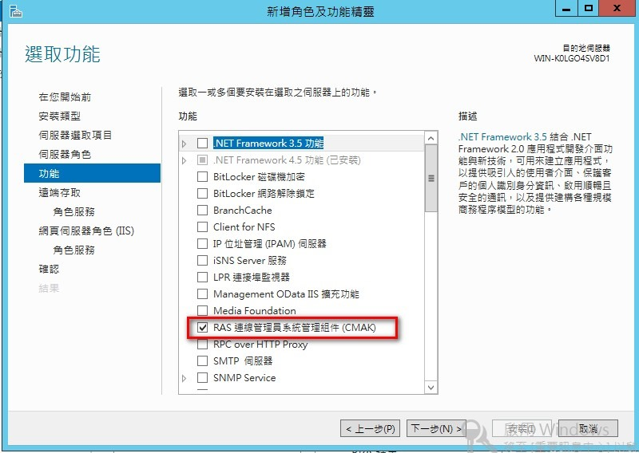
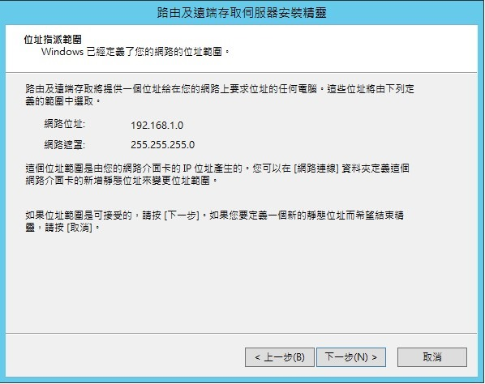

今天來研究Windows平台如何做到 Port Forwarding的功能，將所有的封包進行轉發作業。

# 使用 Windows 內建的 Port Proxy 功能
只支援TCP協定  


``` cmd
// 增加 Port Forwarding
netsh interface portproxy add v4tov4 listenport=4001 listenaddress=192.168.36.100 connectport=4001 connectaddress=192.168.36.75

// 刪除 Port Forwarding
netsh interface portproxy delete v4tov4 listenport=4001 listenaddress=192.168.36.100

// 清除所有的 Port Forwarding
netsh interface portproxy reset

// 顯示目前的 Forwarding 設定
netsh interface portproxy show v4tov4

Listen on ipv4:             Connect to ipv4:
Address         Port        Address         Port
--------------- ----------  --------------- ----------
192.168.36.100  4001        192.168.36.90   4001
```

---
# 使用 Windows Server NAT Server 的 Port Mapping
首先先開啟 NAT 伺服器，使用 TCP/UDP Port對應，讓外部使用者可以存取內部伺服器。

# 安裝 NAT 伺服器
## 伺服器腳色安裝  
伺服器 》 管理 》 新增角色及功能  


選擇 **遠端存取**  


選擇 **RAS連線管理員系統管理組建(CMAK)**  




選擇 **路由**  


## 路由及遠端存取 設定  


伺服器管理員 > 工具 > 點選 路由及遠端存取  


選 **網路位址轉譯 (NAT)**  


選擇 網路卡  



## 配置 NAT 設定  


# Routing Nat Port Mapping
## 使用 Command Line 設定
``` cmd
// 增加 Routing Nat Port Mapping
netsh routing ip nat add portmapping Ethernet0 udp 0.0.0.0 4000 192.168.36.75 4000
// 刪除 Routing Nat Port Mapping
netsh routing ip nat delete portmapping Ethernet0 udp 0.0.0.0 4000

// 顯示目前 Routing Nat Port Mapping
netsh routing ip nat show interface Ethernet0


NAT  Ethernet0 設定
---------------------------
模式              : 位址和連接埠轉譯


NAT 靜態連接埠對應設定
-------------------------------------
通訊協定          : UDP
公用位址          : 0.0.0.0
公用連接埠        : 4000
私人位址          : 192.168.36.90
私人連接埠        : 4000
```

## 使用 UI 設定


新增 Port Mapping  


設定相關對應資料  


# 實際測試結果
## 同網段 的情況下
測試環境
* 發送端
  192.168.36.88  
  向 192.168.36.100 發送 UDP封包

* 轉拋端
  192.168.36.100  
  使用 NAT 轉發 UDP 4000 給 192.168.36.90

* 被轉拋端
  192.168.36.90  
  接收 UDP 封包

### 步驟如下：
1. 192.168.36.88 打給 192.168.36.100
2. 192.168.36.100 轉發給 192.168.36.90 （使用 192.168.36.88 的名義）
3. 192.168.36.90 成功收到
4. 從 192.168.36.90 打回去 ，因打回給 192.168.36.88是同網段，所以不會透過 192.168.36.100發送而是直接打給192.168.36.88，雖然 192.168.36.88有收到資料，但不是192.168.36.100打的資料所以被拒收。  


## 問題思考
為什麼在相同網段情況下會有問題呢？因為通訊埠轉發使用場景是，外網設備需要訪問內網設備時，路由器只單獨開放單一埠進行通訊訪問，如果以路由器的角度來思考，就能理解這次遇到的問題以及要如何解決。

此方法必須滿足以下兩個條件，才能正常工作：
1. **發送端** 與 **被轉拋端** 必須為不同網段。
2. **轉拋端** 通往預設閘道的路上必須經過 **被轉拋端**，最簡單的方式預設閘道設成 **被轉拋端**。

這樣有個問題，**被轉拋端** 的預設閘道設定成 **轉拋端**，那這樣會不會影響**被轉拋端**的上網能力？
答案是不會，**轉拋端** 會協助 **被轉拋端** 進行封包的傳遞，並不會影響對外聯網能力，而只是在原本的通往Gateway中間在增加一個路由器而已。

---
## 不同網段 的情況下
* 發送端
  192.168.36.88  
  向 192.168.36.100 發送 UDP封包

* 轉拋端
  192.168.36.100 && 192.168.28.100  
  使用 NAT 轉發 UDP 4000 給 192.168.36.70

* 被轉拋端
  IP:192.168.28.70  
  GW:192.168.28.100
  接收 UDP 封包
  
### 步驟如下：
1. 192.168.36.88 打給 192.168.36.100
2. 192.168.36.100 轉發給 192.168.28.90 （使用 192.168.36.88 的名義）
3. 192.168.28.70 成功收到
4. 從 192.168.28.70 打回去 ，因打回給IP 192.168.36.88為不同網段，所以會轉去 Gateway 192.168.28.100，192.168.28.100就會成功將封包轉回給192.168.36.88。


---
# 參考資料
* 通訊埠轉發
  - [在 Windows 上配置埠轉發](http://woshub.com/port-forwarding-in-windows/)
  - [Windows 上 UDP 流的简单端口转发](https://cxywk.com/q/Cd3KMBps)

* NAT 伺服器
  - [Windows Server 2012筆記(六) NAT伺服器設定](https://blog.pmail.idv.tw/?p=5165)