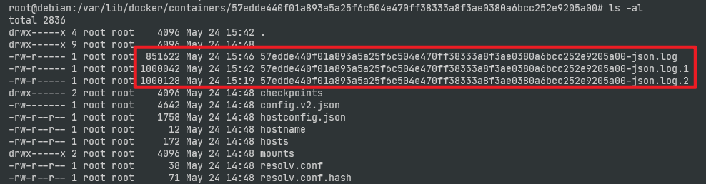

最近在linux測試機上發現，不知為何硬碟空間就滿了，最後查證是docker container log 吃滿，而且吃到11GB都不會清除，查了一下原來需要設定log檔案限制。

默認情況容器的 `stdout` 和 `stderr` 都會被寫入 `/var/lib/docker/containers/[container-id]/[container-id]-json.log` 的 json 文件。如果一直無人理會，這個文件最終會佔用大量的磁盤空間。

``` sh
// 檢查方式
du -Sh /var/lib/docker/containers
```

1. 修改設定檔案
> 【需要注意的是：设置的日志大小规则，只对新建的容器有效】

`/etc/docker/daemon.json`
``` json
{
	// docker 網卡 IP
	"bip": "169.254.0.1/24",
	// docker log format
	"log-driver": "json-file",
	"log-opts": {
		// single file size
		"max-size": "1m",
		// log file count
		"max-file": "3"
	}
}
```


2. 重啟 Docker
下列方法：二擇一
``` sh
systemctl restart docker.service

/etc/init.d/docker restart
```

## 觀察結果
檔案被限制在 1M & 檔案數量維持在 3個內  
這個檔案就是 docker log 檔案  


# 為個別容器 設定
如果不想作全局配置，也可以在個別容器級作日誌驅動程式改動。

* docker-compose
``` yml
version: '3.2'
services:
  nginx:
    image: 'nginx:latest'
    ports:
      - '80:80'
    logging:
      driver: "json-file"
      options:
        max-size: "1k"
        max-file: "3"
```

* docker run
``` sh
$ docker run \
    --log-driver json-file \
    --log-opt max-size=10m \
    --log-opt max-file=10 \
    alpine echo hello world
```


## 參考資料
[解決 Docker log檔肥大，與限定log檔大小、數量](https://www.minwt.com/website/server/21794.html)

[限制&&清除容器日志](https://wiki.butou.ma/docker/xian-zhi-qing-chu-rong-qi-ri-zhi)

[為 Docker 容器設置日誌輪替](https://blog.boatswain.io/zh/post/docker-container-log-rotation/)